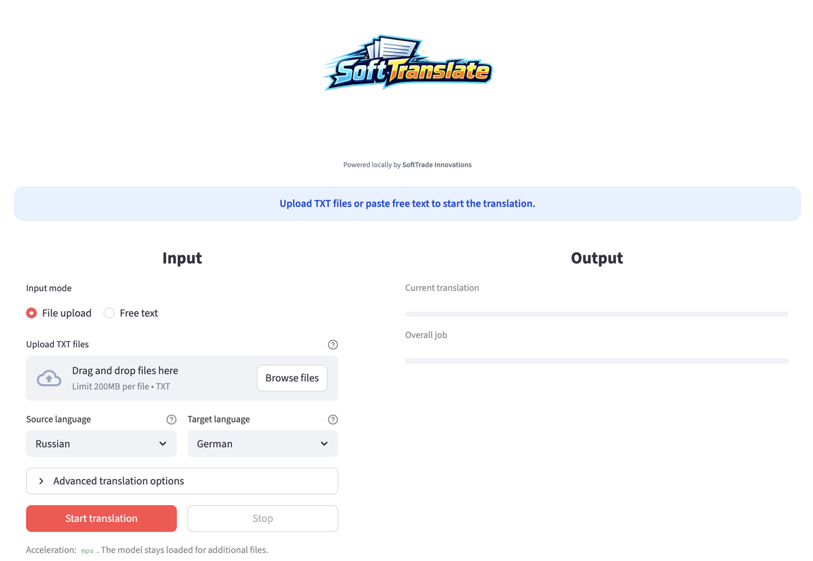

# SoftTranslate

<p align="center">
  
</p>

SoftTranslate is a local Streamlit application for translating structured TXT files with Meta NLLB models.

## Features

- Local browser UI with multi-file TXT upload
- Optional free-text input mode
- UI language toggle for German and English
- Offline translation after the initial model download
- Default support for `facebook/nllb-200-distilled-1.3B`
- Modular structure for future model upgrades
- Auto, paragraph, and sentence segmentation modes
- Structured line preservation for TXT files like `12345; text`
- Optional context overlap mode
- Start/stop controls for long-running translations
- Side-by-side preview, per-file downloads, and ZIP export
- Job-based output folders inside `output/<session-id>/`
- Local logs and generated outputs that stay on disk
- Glossary hook for terminology control

## Requirements

- macOS on Apple Silicon recommended
- Python 3.11 or 3.12
- `venv`
- Enough free disk space for the Hugging Face model download

## Installation

```bash
python3.11 -m venv .venv
source .venv/bin/activate
pip install --upgrade pip
pip install -r requirements.txt
```

## Model Download

On first launch, the app downloads `facebook/nllb-200-distilled-1.3B` from Hugging Face and stores it in the local cache. After that, translation runs locally as long as the model is already cached.

Prepared model options:

- `facebook/nllb-200-distilled-1.3B`
- `facebook/nllb-200-3.3B`

## Run

```bash
streamlit run app.py
```

Then open the local URL shown by Streamlit, typically `http://localhost:8501`.

## Workflow

1. Choose the UI language in the top-left corner.
2. Select either file upload or free-text mode.
3. Choose the source and target language.
4. Optionally adjust segmentation, glossary, and context settings.
5. Start the translation.
6. Monitor the current-file and overall-job progress bars.
7. Stop the run at any time if needed.
8. Review results and download individual TXT files or a ZIP archive.

## Logo

The app automatically loads a PNG logo from:

```text
assets/logo.png
```

Recommended asset settings:

- Filename: `logo.png`
- Location: `assets/logo.png`
- Format: PNG with transparent background
- Recommended width: 512 px to 1024 px
- Recommended aspect ratio: square or slightly portrait

If the file is present, it is rendered in the header. If not, the app falls back to the default text block.

## Project Structure

```text
softtranslate/
├── app.py
├── requirements.txt
├── README.md
├── assets/
│   └── logo.png
├── config/
│   └── languages.py
├── core/
│   ├── glossary.py
│   ├── io_utils.py
│   ├── model_manager.py
│   ├── reassembler.py
│   ├── segmenter.py
│   └── translator.py
├── logs/
├── output/
├── temp/
└── tests/
```

## Notes

- If the model fails to load, check available RAM and disk space first.
- For very large files, reduce the segment length.
- If MPS is unavailable, the app falls back to CPU automatically.
- Empty or unreadable files are handled per file and do not stop the full batch.
- If a translation is cancelled, partial results are kept when at least one segment has completed.
- Switching between upload mode and free-text mode resets the stale UI state intentionally.

## Privacy

- No cloud API is used for the actual translation step.
- Only the initial model download requires a network connection.
- Logs and generated outputs stay inside the local project directory.
- The repository is configured to ignore local outputs, logs, caches, and virtual environments.

## Public Repo Safety

- No passwords, API keys, or private tokens are required by the current app code.
- The project currently stores no user identity paths or local machine paths in the tracked README.
- Before publishing results, still review generated TXT files in `output/` because they may contain user content even though that folder is ignored by Git.

## Extension Points

- Larger model support: `core/model_manager.py`
- Glossary logic: `core/glossary.py`
- Additional languages: `config/languages.py`
- Input/output handling: `core/io_utils.py`
